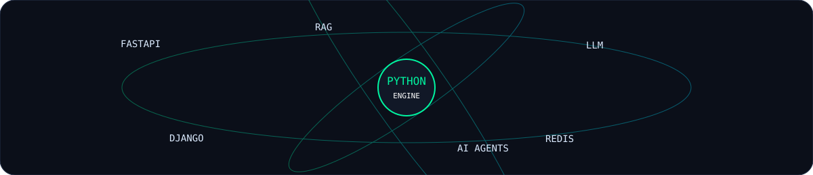
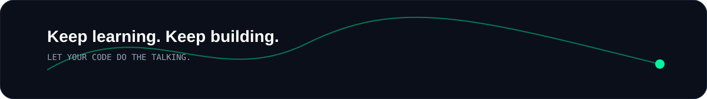

<!-- ═══════════════════════════════════════════════════════════════════════
     VIKAS SHARMA — ANIMATED GITHUB PROFILE
     Replace asset URLs only if you move the SVG files.
═══════════════════════════════════════════════════════════════════════ -->

### Python Engineer · AI & GenAI · LLMs · Backend Systems

  
  
  

---

## ⚡ About Me

I'm **Vikas Sharma**, a **Python Engineer with 3+ years of experience** building backend applications, automation workflows and AI-powered systems.

My current focus is the intersection of **Python + Backend Engineering + Generative AI** — turning LLM capabilities into practical products rather than just demos.

- 🐍 Building with **Python, Django, FastAPI and REST APIs**
- 🤖 Exploring **GenAI, LLMs, RAG and AI Agents**
- 🧠 Working with **prompt engineering, embeddings, vector databases and LLM APIs**
- ⚙️ Comfortable with **Redis, Celery, background jobs and production-style backend systems**
- ☁️ Working with **AWS and cloud deployment**
- 🗄️ Building with **SQL, MySQL and PostgreSQL**
- 🎥 Creating practical developer content on **PyRuntime**
- 🚀 Always learning, shipping and improving

---

## 🧬 My Engineering Stack

### 🐍 Backend & Python
`Python` `Django` `FastAPI` `Django REST Framework` `REST APIs` `Celery` `Redis`

### 🤖 AI / ML / GenAI
`LLMs` `Generative AI` `RAG` `AI Agents` `LangChain` `Prompt Engineering` `Embeddings`
`Vector Databases` `Machine Learning` `Scikit-learn` `NLP`

### 🗄️ Data
`PostgreSQL` `MySQL` `SQL` `Pandas` `NumPy`

### ☁️ Cloud & DevOps
`AWS` `EC2` `RDS` `Git` `GitHub` `Linux` `Nginx`

### 🎨 Frontend
`React` `HTML` `CSS` `Bootstrap`

---

## 🪪 Developer ID

---

## 🚀 What I'm Building

<table>
<tr>
<td width="50%">

### 🤖 AI Data Scientist Workspace

An AI-assisted workspace for dataset analysis, notebook execution, preprocessing, model training and ML experimentation.

**Stack:** Python · FastAPI · React · PostgreSQL · Redis · AI Agents

</td>
<td width="50%">

### 🧠 AI / LLM Applications

Building practical applications around **RAG, LLMs, agents, tool calling and automation** with a strong Python backend.

**Stack:** Python · FastAPI · LLM APIs · Vector DB · Redis

</td>
</tr>

<tr>
<td width="50%">

### 🎓 FocusIn

A productivity and preparation platform designed around study schedules, question banks, performance tracking and learning workflows.

**Stack:** React Native · Firebase · AI

</td>
<td width="50%">

### 📊 Machine Learning Projects

End-to-end ML projects covering data analysis, preprocessing, feature engineering, model training and evaluation.

**Stack:** Python · Pandas · Scikit-learn · Jupyter

</td>
</tr>
</table>

---

## 📊 GitHub Dashboard

  
  

  

---

## 🏗️ Engineering Philosophy

> **Build it. Break it. Understand it. Improve it. Ship it.**

I believe the best way to learn engineering is to build systems that solve real problems — then keep improving them through debugging, experimentation and production experience.

---

## 🌐 Connect With Me

  
  
  
  

---

### ⭐ Keep learning. Keep building. Let your code do the talking.

